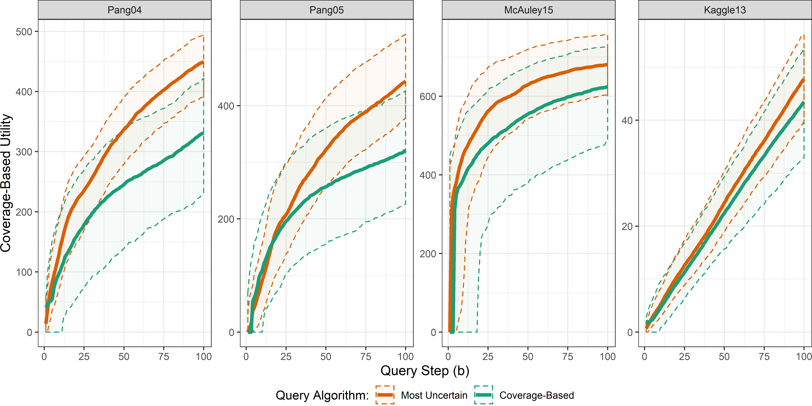
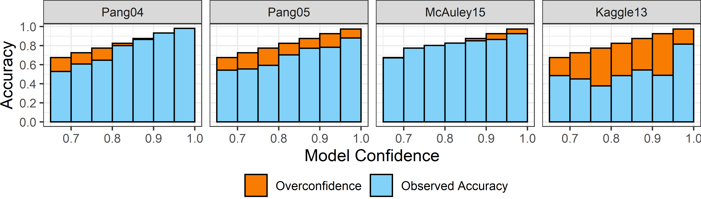

<style>
  .col2 {
    columns: 2 200px;         /* number of columns and width in pixels*/
    -webkit-columns: 2 200px; /* chrome, safari */
    -moz-columns: 2 200px;    /* firefox */
  }
  .col3 {
    columns: 3 100px;
    -webkit-columns: 3 100px;
    -moz-columns: 3 100px;
  }
</style>

```{r xaringan-themer, include = FALSE, eval=FALSE}
# devtools::install_github("gadenbuie/xaringanthemer")
library(xaringanthemer)
SO_gold = "#cc8a00"
duo_accent(primary_color = "black",secondary_color = SO_gold,header_color = SO_gold,title_slide_text_color = SO_gold)
```


```{r setup, include=FALSE}
options(htmltools.dir.version = FALSE)
library(tidyverse)
library(mvtnorm)
library(ggvoronoi)
library(iqbin)
library(gganimate)

```

### Who am I?

```{r, out.width = "320px", echo=FALSE}
knitr::include_graphics("http://kmaurer.github.io/CV_files/figure-html/unnamed-chunk-1-1.png")
```

#### Karsten Maurer

- Minnesota, Morris for BA in History and Statistics
- Iowa State for Masters and PhD in Statistics
--

- Currently an Assistant Professor of Statistics at Miami University

+ Teaching: Data Visualization, Predictive Modeling, Statistical Programming
+ Research: Statistics Education, Machine Learning, Visualization, Collaborative Consulting


---

### Overview of Today's Talk

#### Unknown Unknowns

- Exisiting Literature on Utility-Based Query Algorithms
- Deficiencies in existing methods

#### Facility Locations Search Algorithm
- Adapting utility objectives to overcome deficiencies
- Facility Locations Utility Function
- Greedy Adaptive Query Algorithm
- Empirical Experiment Results

#### Adversarial Distances for Unsupervised Query Set Selection
- Objective and Intuition
- Adversarial Distance-Based Query Algorithm
- Empirical Experiment Results

#### Discussion
- Conclusions and Future Work

---

class: center, middle
## Unknown Unknowns

---

### Unknown Unknowns

**Context**: You have a classifier that you wish to apply to a domaine in which you only have access to a large set of unlabeled test instances. 

<br>

--

**Problem**: You know that the classifier was trained in a different domaine, or you suspect a bias in the training set relative to the testing 

<br>

--

**Goal**: Select a set of instances from the unlabeled set that we will look up true labels which we use to evaluate the classifier performance. This is called a *query* of the unlabeled set. 

<br>

--

An *oracle* is the person who will find the true labels. We don't want to waste the oracle's time, so we need a smart way to query the unlabeled set.  

---

### Unknown Unknowns

#### What are we looking for in the query set?

Attenberg et al. (2015) define *Unknown Unknowns* (UUs) as instances, $x$, from unlabeled test set where the classifier, $f(\cdot)$, is both:
  - Highly confident. Above some threshold $\tau\in (0,1)$. Thus,  $C_{x} \ge \tau$ 
  - Wrong. Misclassified with $y \ne f(x)$

<br>

--

#### Why would we care about finding UUs in query set?

- High confidence mistakes lead to unmitigated risks in application of classifier
- Characteristics of the UUs may help analyst to understand classifier deficiencies

---

### Unknown Unknowns

#### Example: Image Classifier for Cats and Dogs

- Bias in training set: Cats with light fur and Dogs with dark fur
- Test set has all color fur for both cats and dogs
- Classifier likely to be highly confident but wrong about dark cats and light dogs 
- A query set that finds these UUs could help us to identify the model deficiency from animal fir color

---

### Exisiting Literature on Utility-Based Query Algorithms

#### Attenberg et al. (2015) 
  - "Beat the Machine" game with monetary rewards for finding UUs
  - Crowdsourcing as mechanism for learning classifier deficiencies 
  - Basically like using many oracles with large budget for labelling 

--

#### Lakkaraju et al. (2017)
  - Adaptive query algorithm that updates the optimal recommendation for next oracle query after evaluating the newly labeled instance
  - Utility function provides a unit value for each discovered UU and penalizes by the cost of labeling
  
--

#### Bansal and Weld (2018)
  - Another greedy query algorithm, but uses coverage-based utility
  - Goal is to encourage both discovery of UUs and exploration of feature space
  
---

### Coverage-Based Utility Details
  
<br><br>  
  
$$U(Q) = \sum_{x \in \mathbb{X}} c_x \cdot \max_{q \in S} \left\{sim\left(x,q \right) \right\}$$ 

- $\mathbb{X} \subset \mathbb{R}^p$ is $p$-dimensional unlabeled test set

- $Q \subset \mathbb{X}$ is the set of points labeled by an oracle,

- $S = \left\{x|x \in Q, y_x \neq M(x)\right\}$ is the set of discovered UUs 

- Classifier $M(x):\mathbb{X} \rightarrow class$,

- $c_x$ is the classifier's confidence in its prediction of $x$, 

- $sim(x,q)$ is a distance-based similarity metric.   
  
---

### Deficiencies in existing methods

#### Attenberg et al. (2015) 
- If the cost of oracle queries is the reason we need an algorithm, then crowd-sourcing the solution is not viable

--

#### Lakkaraju et al. (2017) 
- Fundamentally place value on finding *any* UU, regardless of confidence

- This ignores the number of misclassification we **expect** based on the confidence scores

#### Bansal and Weld (2018)
- Places value on high confidence instances being *close to* UUs
 
--

### Why is this a problem?

- The utility-based algorithms err toward instances that are "safe bets"; instances with confidence just above the $\tau$ threshold. 
- The utility functions reward selection of the most-uncertain (least confident) UUs
  
---

### Coverage-Based Query vs. Most-Uncertain Query

```{r coveragevsMU,echo=F,include=T,eval=T,fig.width=5,fig.width=6,fig.align='center', cache=TRUE}
 
```


---

class: center, middle
## Facility Locations Search Algorithm

---

### Adapting utility objectives to overcome deficiencies
 
#### Claims: 

the focus on discovering Unknown Unknowns, as defined in current literature, is flawed.

High confidence should not be intepreted as an absolute. Misclassifications *should* be occuring.

The problem is when the rate of misclassification exceeds the rate expected based on classifier confidence. 

--

### Adaptated Objectives:

1. Our goal should be to query instances that demonstrate *classifier overconfidence*; containing more misclassification than should be expected based on classifier confidence. 
2. Our query should also seek to thoroughly explore the feature space. 

Thus, we propose a new utility function and associated greedy query algorithm that rewards both of these new objectives

---

### Facility Locations Utility Function

<br><br>

$$W(Q) = \sum_{q \in S} r \left(c_q\right) - \frac{1}{n} \sum_{x \in \mathbb{X}} \min_{q \in S}\left(d\left(x,q\right)\right)$$
<br><br>

$r\left(c_q\right) = \log(1/(1-c_q))$ is the *reward* function for finding a misclassification with confidence $c_{q}$

<br>

$d(x,q)$ is the Euclidean distance between points $x$ and $q$.

---

### Algorithm for Greedy Facility Location Search

**Input:** 
Test set $\mathbb{X}$, prior $\hat{\phi}\left(x|Q=\emptyset\right)$, budget B
$Q=\{\}$ inputs that have been queried
$y_Q = \{\}$ oracle defined labels

**For:** b = 1, 2, ..., B **do:**

 $q' = argmax_{q' \not\in Q} E \left[W\left(Q \cup q'\right) \right]$

 $Q \leftarrow Q \cup q'$

 $y_Q \leftarrow y_Q \cup y_{q'}$

 $S \leftarrow \left\{x | x \in Q \space \text{ and } y_x \neq M(x) \right\}$

 $b \leftarrow b + 1$

**Return:** $Q$, $S$ and $y_Q$Q, S and yQ

---

### Empirical Experiment Results

#### Datasets 

```{r FLUvsMU,echo=F,include=T,eval=T,fig.align='center', cache=TRUE}

```

--

<br>

1. Compare Facility Location Query vs. Most-Uncertain Query baseline

2. Evaluate the efficiency of query algorithms in finding misclassification relative to the confidence of the selected instances

---

class: center, middle
## Adversarial Distances for Unsupervised Query Set Selection

---

### Objective and Intuition
asdf

---

### Adversarial Distance-Based Query Algorithm
asdf

---

### Empirical Experiment Results
asdf

---
class: center, middle
## Discussion

---
  
### Benefits and Drawbacks of KNN
  
asdfs  

---
  
### Conclusions and Future Work

asdasf
  
---
  
#### Code Repository

- These Slides: *https://github.com/kmaurer/search2020/tree/master/ResearchTalk*
- Facility Locations Utility: *https://github.com/kmaurer/uuutils*

#### Software and Data
  
- Garrett, Nar, Fisher, Maurer (2018). ggvoronoi: Voronoi Diagrams and Heatmaps with ggplot2. J. Open Source Software, 3(32), 1096.
- Kuhn (2019). caret: Classification and Regression Training. R package version 6.0-84. *https://CRAN.R-project.org/package=caret*
- R Core Team (2019). R: A language and environment for statistical computing. 
- R Foundation for Statistical Computing, Vienna, Austria. URL *https://www.R-project.org/*.
- RStudio Team (2016). RStudio: Integrated Development for R. RStudio, Inc., Boston, MA URL *http://www.rstudio.com/*.
- Wickham (2017). tidyverse: Easily Install and Load the 'Tidyverse'. R package version 1.2.1. *https://CRAN.R-project.org/package=tidyverse*
- Wickham (2019). rvest: Easily Harvest (Scrape) Web Pages. R package version 0.3.4. *https://CRAN.R-project.org/package=rvest*
- Xie (2019). knitr: A General-Purpose Package for Dynamic Report Generation in R. R package version 1.22.
- Zillow home listings data from Oxford, Ohio. *https://www.zillow.com/*
      
---

### References

- Arya, V.; Garg, N.; Khandekar, R.; Meyerson, A.; Munagala, K.; and Pandit, V. 2004. Local search heuristics for k-median and facility location problems. SIAM Journal on computing 33(3):544–562.
- Attenberg, J.; Ipeirotis, P.; and Provost, F. 2015. Beat the Machine. Journal of Data and Information Quality 6(1):1–17.
- Bansal, G., and Weld, D. S. 2018. A coverage-based utility model for identifying unknown unknowns. In AAAI.
- Bella, A.; Ferri, C.; Hern´andez-Orallo, J.; and Ram´ırez-Quintana, M. J. 2010. Calibration of machine learning models. In Handbook of Research on Machine Learning Applications and Trends: Algorithms, Methods, and Techniques. IGI Global. 128–146.
- Brendel, W. ; Rauber, J.; and Bethge, M. 2017. Decision-based adversarial attacks: Reliable attacks against black-box machine learning models. arXiv preprint arXiv:1712.04248, 2017. 2, 6
- Casella, G., and Berger, R. L. 2002. Statistical inference, volume 2. Duxbury Pacific Grove, CA.
- Farahani, R. Z., and Hekmatfar, M. 2009. Facility location: concepts, models, algorithms and case studies. Springer.
- Goodfellow, I. J.; Shlens, J.; and Szegedy, C. 2015. Explaining and Harnessing Adversarial Examples. Iclr, pages 1–11, 2.
- Guha, S., and Khuller, S. 1999. Greedy strikes back: Improved facility location algorithms. Journal of algorithms 31(1):228–248.
- Guo, C.; Pleiss, G.; Sun, Y.; and Weinberger, K. Q.. On Calibration of Modern Neural Networks. In International Conference on Machine Learning, 2017. 3, 5
- Kaggle. 2013. www.kaggle.com/c/dogs-vs-cats. Accessed: 2018-08-28.

---

### References (continued)

- Lakkaraju, H.; Kamar, E.; Caruana, R.; and Horvitz, E. 2017. Identifying unknown unknowns in the open world: Representations and policies for guided exploration. In AAAI.
- Liu, Z.; Luo, P.; Wang, X.; and Tang X. 2015. Deep learning face
attributes in the wild. In Proceedings of International Conference on Computer Vision (ICCV), 5
- McAuley, J.; Pandey, R.; and Leskovec, J. 2015. Inferring networks of substitutable and complementary products. In Proceedings of the 21th ACM SIGKDD International Conference on Knowledge Discovery and Data Mining, 785–794. ACM.
- Nushi, B.; Kamar, E.; Horvitz, E.; and Kossmann, D. 2016. On Human Intellect and Machine Failures: Troubleshooting Integrative Machine Learning Systems.
- Ozan, S.; and Savarese, S. 2018. Active Learning for Convolutional Neural Networks: A Core-Set Approach. In ICLR 2018, pages 1–13, 2018. 1
- Pang, B., and Lee, L. 2004. A sentimental education: Sentiment analysis using subjectivity summarization based on minimum cuts. In Proceedings of the 42nd annual meeting on Association for Computational Linguistics, 271. Association for Computational Linguistics.
- Pang, B., and Lee, L. 2005. Seeing stars: Exploiting class relationships for sentiment categorization with respect to rating scales. In Proceedings of the 43rd annual meeting on association for computational linguistics, 115–124. Association for Computational Linguistics.
- Patel, V.; Gopalan, R.; Li, R.; and Chellappa, R. 2014. Visual Domain Adaptation: An Overview of Recent Advances. 1–34.
- Rauber, J.; Brendel, W.; and Bethge, M. 2017. Foolbox: A python toolbox to benchmark the robustness of machine learning models. arXiv preprint arXiv:1707.04131, 2017. 2

      
---

### References (continued)

- Ribeiro, M. T.; Singh, S.; and Guestrin, C. 2016. Why Should I Trust You: Explaining the Predictions of Any Classifier. 22nd ACM SIGKDD International Conference on Knowledge Discovery and Data Mining, 2016. 6
- Rosner, B. 2015. Fundamentals of biostatistics. Nelson Education.
- Settles, B. 2010. Active Learning Literature Survey. Machine Learning 15(2):201–221.
- Stock, P., and Cisse, M. 2017. Convnets and imagenet beyond accuracy: Explanations, bias detection, adversarial examples and model criticism. arXiv preprint arXiv:1711.11443.
- Sugiyama, M.; Lawrence, N. D.; Schwaighofer, A.; et al. 2017. Dataset shift in machine learning. The MIT Press.
- Taylor, P. 2013. Standardized mortality ratios. International journal of epidemiology 42(6):1882–1890.
- Wang, K.; Zhang, D.; Li, Y.; Zhang, R.; and Lin, L. 2017. CostEffective Active Learning for Deep Image Classification. pages 1–10, 2017. 1 
- Yu, A.; and Grauman, K. 2014. Fine-grained visual comparisons with local learning. In Computer Vision and Pattern Recognition (CVPR), Jun 2014. 5
- Yu A.; and Grauman, K. 2017. Semantic jitter: Dense supervision for visual comparisons via synthetic images. In International Conference on Computer Vision (ICCV), Oct 2017. 5
- Zheng, B.; Lin, X.; Xiao, Y.; Yang, J.; and He, L. 2018. An effective method for identifying unknown unknowns with noisy oracle. In International Conference on Case-Based Reasoning, pages 480–495. Springer, 2018. 2    
      
---

class: center, middle
    
# Thanks!
    
Slides created via the R package [**xaringan**](https://github.com/yihui/xaringan).