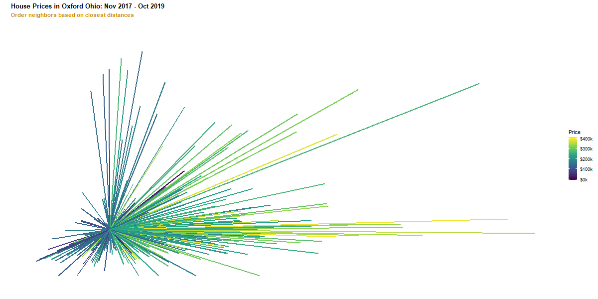

<style>
  .col2 {
    columns: 2 200px;         /* number of columns and width in pixels*/
    -webkit-columns: 2 200px; /* chrome, safari */
    -moz-columns: 2 200px;    /* firefox */
  }
  .col3 {
    columns: 3 100px;
    -webkit-columns: 3 100px;
    -moz-columns: 3 100px;
  }
</style>

```{r xaringan-themer, include = FALSE}
# devtools::install_github("gadenbuie/xaringanthemer")
library(xaringanthemer)
SO_gold = "#cc8a00"
duo_accent(primary_color = "black",secondary_color = SO_gold,header_color = SO_gold,title_slide_text_color = SO_gold)
```


```{r setup, include=FALSE}
options(htmltools.dir.version = FALSE)
library(tidyverse)
library(mvtnorm)
library(ggvoronoi)
library(iqbin)
library(gganimate)

```


### Who am I?

```{r, out.width = "320px", echo=FALSE}
knitr::include_graphics("http://kmaurer.github.io/CV_files/figure-html/unnamed-chunk-1-1.png")
```

#### Karsten Maurer

- Originally from Champlin, MN

- Went to Minnesota, Morris for BA in history and statistics

- Went to Iowa State for PhD in statistics

--

- Currently an Assistant Professor of Statistics at Miami University
  
    + Teaching: Data Visualization, Predictive Modeling, Statistical Programming
    + Research: Statistics Education, Machine Learning, Visualization, Collaborative Consulting


---
### Predictive Modeling Background - Discussion

- What types of predictive models have you encountered in your classes so far?

<br><br><br><br><br><br><br><br><br><br>

--

- What are the two general types of responses that we might try to predict? (Supervised Learning)


---
class: center, middle
## A **K-Nearest Neighbor model** generates predictions based on the responses of the **K most similar** previously observed instances. 

--

... before getting into any notation, let's build the intuition with an exercise.

---

### Predicting Sleep

You have two tasks:

1. Think back to last night. How many hours of sleep did you get? **This is your response value**
<br><br>

2. Ask the 3 people sitting closest to you how much sleep they got. **These are your neighbor's responses**
<br><br><br><br>

--

### Making a prediction about your sleep

Suppose that where you sit in the room (predictor) holds information about how much you sleep (response)
<br><br>

How could we use your neighbor's sleep values to predict for you?

---

### KNN Regression

If $Y_i \in \mathbb{R}$ is your numeric response for instances $i=1,2,...,n$

and $\bf{X_i} \in \mathbb{R}^p$ is your $p$-dimensional numeric predictors
<br><br><br>

--

Suppose we have new instance with predictors $\bf{X_0}$ 
<br><br><br>

--

Define the set of K-Nearest Neighbors based on some distance function $d(.)$ (Typically Euclidean)

$\mathcal{N}_0 = \{i | d({\bf X_i}, {\bf X_0}) \le d({\bf X_{[k]}}, {\bf X_0})\}$

<br><br>


--

Prediction is average of K-neighbors:   $\hat{Y}_0 = \frac{1}{K}\sum_{i \in \mathcal{N}_0} Y_i$

---

### KNN Sleep Regression

$Y$  = sleep hours, $X_1$ =Position Left/Right, $X_2$ =Position Front/Back
<br><br><br>


$\bf{X_0}$ is your seat location
<br><br><br>

$\mathcal{N}_0$  are indices that identify your 3 closest neighbors
<br><br><br>

Our prediction for you is the average sleep from your 3 closest neighbors
<br><br><br>

---

### KNN Algorithm

To predict for any new observation $\bf{X_0}$

1. Compute the distances between $\bf{X_0}$ and all previous observations
2. Sort distances smallest to largest
3. Select K smallest, record which observations these belong to
4. Compute the average response of these observation 
---

### Case Study: Real Estate

Motivation: 

---

### Case Study: Real Estate

```{r KNN_plot_house,echo=F,include=T,eval=T, fig.align='center'}
load("~/GitHub/search2020/TeachingDemo/sold_homes2.Rdata")

oxford_real_estate <- details_tall %>% 
  unique() %>%
  spread(key, value) %>%
  right_join(all_sold, by=c(url="url")) %>%
  mutate(lot_units = word(Lot, -1),
         lot_size = ifelse(lot_units=="acres",
                           as.numeric(str_remove(word(Lot,1),","))*43560, 
                           as.numeric(str_remove(word(Lot,1),","))),
         sqft = as.numeric(str_remove(word(`Floor size`,1),",")),
         sale_price =  as.numeric(gsub('\\$|,', '',word(`Last sold`,-1))),
         sale_month = word(`Last sold`,1,2)) %>%
  select(street:sale_month, -lot_units)%>%
  na.omit() %>%
  filter(lot_size < 87120,
         sale_price < 400000)

mytheme <- theme_bw() + 
  theme(panel.grid.minor = element_blank(),
        panel.border = element_blank(),
        plot.title = element_text(face="bold"),
        plot.subtitle = element_text(face="bold", color=SO_gold))


# p1 <- ggplot()+
#   geom_point(aes(x=sqft,y=lot_size, color=sale_price),
#              data=oxford_real_estate, size=2) +
#   scale_color_viridis_c("Price",
#                         limits = c(0,400000),
#                         breaks = seq(0,400000,by=100000),
#                         labels = paste0("$",seq(0,400,by=100),"k"))+
#   labs(x=expression(paste("Floor Space (",ft^2,")")),
#        y=expression(paste("Lot Size (",ft^2,")")),
#        title="House Prices in Oxford Ohio: Nov 2017 - Oct 2019",
#        subtitle="Homes Under $400k and Under 2 Acre Lotsize") +
#   mytheme
# ggsave(file="OxfordHouses.png",dpi=600,
#        width=10, height=5,units="in")


```

---

### Case Study: Real Estate

```{r KNN_plot_house_me,echo=F,include=T,eval=T, fig.align='center'}
my_house <- data.frame(sqft = 1300, lot_size=17000, zestimate=161000)

# p2 <- ggplot()+
#   geom_point(aes(x=sqft,y=lot_size, color=sale_price),
#              data=oxford_real_estate, size=2) +
#   geom_point(aes(x=sqft,y=lot_size),shape=18, color="red",size=5,data=my_house)+
#   geom_text(aes(x=sqft,y=lot_size),hjust=1.1,vjust=0.5,angle=-45,
#             label="My House",color="red",size=5,data=my_house)+
#   scale_color_viridis_c("Price",
#                         limits = c(0,400000),
#                         breaks = seq(0,400000,by=100000),
#                         labels = paste0("$",seq(0,400,by=100),"k"))+
#   labs(x=expression(paste("Floor Space (",ft^2,")")),
#        y=expression(paste("Lot Size (",ft^2,")")),
#        title="House Prices in Oxford Ohio: Nov 2017 - Oct 2019",
#        subtitle="Where is my house?") +
#   mytheme
# ggsave(file="OxfordHousesPlusMe.png",dpi=600,
#        width=10, height=5,units="in")


```


---

### Case Study: Real Estate

```{r KNN_dist_from_me_standarized,echo=F,include=T,eval=T, fig.align='center'}
oxford_real_estate$std_sqft <- scale(oxford_real_estate$sqft)
oxford_real_estate$std_lot <- scale(oxford_real_estate$lot_size)

sqft_mean = attributes(oxford_real_estate$std_sqft)[2][[1]]
sqft_sd = attributes(oxford_real_estate$std_sqft)[3][[1]]
lot_mean = attributes(oxford_real_estate$std_lot)[2][[1]]
lot_sd = attributes(oxford_real_estate$std_lot)[3][[1]]

my_house_std <- data.frame(sqft = (1300-sqft_mean)/sqft_sd,
                           lot_size=(17000-lot_mean)/lot_sd,
                           zestimate=161000)

# p3 <- ggplot()+
#   geom_point(aes(x=std_sqft,y=std_lot, color=sale_price),size=2,
#              data=oxford_real_estate) +
#   geom_point(aes(x=sqft,y=lot_size),shape=18, color="red",size=5,data=my_house_std)+
#   scale_color_viridis_c("Price",
#                         limits = c(0,400000),
#                         breaks = seq(0,400000,by=100000),
#                         labels = paste0("$",seq(0,400,by=100),"k"))+
#   labs(x="Standardized Floor Space",
#        y="Standardized Lot Size",
#        title="House Prices in Oxford Ohio: Nov 2017 - Oct 2019",
#        subtitle=expression(paste("Standardized units for ",X[1]," and ", X[2])),
#        parse=T) +
#   mytheme
# 
# ggsave(file="OxfordHousesPlusMe_standardized.png",dpi=600,
#        width=10, height=5,units="in")


```

---

### Case Study: Real Estate

```{r KNN_dist_from_me,echo=F,include=T,eval=T, fig.align='center'}

oxford_real_estate$std_sqft <- scale(oxford_real_estate$sqft)
oxford_real_estate$std_lot <- scale(oxford_real_estate$lot_size)

sqft_mean = attributes(oxford_real_estate$std_sqft)[2][[1]]
sqft_sd = attributes(oxford_real_estate$std_sqft)[3][[1]]
lot_mean = attributes(oxford_real_estate$std_lot)[2][[1]]
lot_sd = attributes(oxford_real_estate$std_lot)[3][[1]]

my_house_std <- data.frame(sqft = (1300-sqft_mean)/sqft_sd,
                           lot_size=(17000-lot_mean)/lot_sd,
                           zestimate=161000)

# p4 <- ggplot()+
#   geom_segment(aes(x=my_house_std$sqft,y=my_house_std$lot_size,
#                    xend=std_sqft,yend=std_lot, color=sale_price),
#                 size=1,
#              data=oxford_real_estate) +
#   geom_point(aes(x=sqft,y=lot_size),shape=18, color="red",size=5,data=my_house_std)+
#   scale_color_viridis_c("Price",
#                         limits = c(0,400000),
#                         breaks = seq(0,400000,by=100000),
#                         labels = paste0("$",seq(0,400,by=100),"k"))+
  # labs(x="Standardized Floor Space",
  #      y="Standardized Lot Size",
#        title="House Prices in Oxford Ohio: Nov 2017 - Oct 2019",
#        subtitle="How far are they all from my house?") +
#   mytheme
# ggsave(file="OxfordHousesDistFromMe.png",dpi=600,
#        width=10, height=5,units="in")


```

---

### Case Study: Real Estate

```{r KNN_dist_from_me_rearranged,echo=F,include=T,eval=T, fig.align='center', echo=FALSE}
oxford_real_estate$std_sqft <- scale(oxford_real_estate$sqft)
oxford_real_estate$std_lot <- scale(oxford_real_estate$lot_size)

# Making transition sorting animation: start with points at location from last slide
Original <- oxford_real_estate %>%
  mutate(x=my_house_std$sqft,
         y=my_house_std$lot_size,
         xend=std_sqft,
         yend=std_lot,
         type="Original") %>%
  select(x,xend,y,yend,sale_price,type)

# distance calculation function
mydistance <- function(x11,x12,x21,x22){
  sqrt((x11-x21)^2 + (x12-x22)^2)  
}
# apply distance function to find order of nearest neighbors 
distfromme <- mydistance(x11=oxford_real_estate$std_sqft,
                        x12=oxford_real_estate$std_lot,
                        x21=my_house_std$sqft,
                        x22=my_house_std$lot)

# apply uniform transformation to keep window same after x changes to order stat
uniminmax_house <- function(x){
  (x-min(x))/diff(range(x))*diff(range(oxford_real_estate$std_sqft)) +
    min(oxford_real_estate$std_sqft)
}
# Rearranged with vertical lines in order from nearest to farthest neighbor, 
# keep order in data same as original so that animation transition is smooth
rearranged <- data.frame(x=NA,
                         xend=NA,
                         y=0+min(oxford_real_estate$std_lot),
                         yend=distfromme+min(oxford_real_estate$std_lot),
                         sale_price=oxford_real_estate$sale_price,
                         type="Rearranged")
rearranged$x[order(distfromme,decreasing=FALSE)] <- uniminmax_house(1:nrow(rearranged))
rearranged$xend[order(distfromme,decreasing=FALSE)] <-  uniminmax_house(1:nrow(rearranged))

#combined start and end position of lines
transition_plot_data <- rbind(Original,rearranged)

# Label Data - Add if time permits

# # build plots and animate
# p5 <- ggplot()+
#   geom_segment(aes(x=x, y=y, xend=xend, yend=yend, color=sale_price),
#                 size=1,
#              data=transition_plot_data)+
#   scale_color_viridis_c("Price",
#                         limits = c(0,400000),
#                         breaks = seq(0,400000,by=100000),
#                         labels = paste0("$",seq(0,400,by=100),"k"))+
#   labs(x="",
#        y="",
#        title="House Prices in Oxford Ohio: Nov 2017 - Oct 2019",
#        subtitle="Order neighbors based on closest distances") +
#   mytheme +
#   theme(axis.ticks = element_blank(),
#         axis.text = element_blank(),
#         panel.grid = element_blank())

# options(gganimate.dev_args = list(width = 1200, height = 600))
# animation::ani.options(ani.width= 2000, ani.height=1000, ani.res = 600)
# anim <- animate( p5 +
#   transition_states(type,
#                     transition_length = 2,
#                     state_length = 1))
# 
# anim
# anim_save("SortingNeighbors.gif", anim)
```




---

### Case Study: Real Estate

```{r KNN_dist_from_me_rearranged_static,echo=F,include=T,eval=T, fig.align='center', echo=FALSE}

# p6 <- ggplot()+
#   geom_segment(aes(x=x, xend=xend, y=y-min(oxford_real_estate$std_lot),
#                    yend=yend-min(oxford_real_estate$std_lot), color=sale_price),
#                 size=1,
#              data=dplyr::filter(transition_plot_data, type=="Rearranged"))+
#   scale_color_viridis_c("Price",
#                         limits = c(0,400000),
#                         breaks = seq(0,400000,by=100000),
#                         labels = paste0("$",seq(0,400,by=100),"k"))+
#   scale_y_continuous(breaks=0:5)+
#   labs(x="Ordered Neighbors",
#        y="Standardized Distance",
#        title="House Prices in Oxford Ohio: Nov 2017 - Oct 2019",
#        subtitle="Order neighbors based on closest distances") +
#   mytheme +
#   theme(axis.ticks.x = element_blank(),
#         axis.text.x = element_blank(),
#         panel.grid.major.x = element_blank(),
#         panel.grid.minor.x = element_blank())
# 
# ggsave(file="OxfordHousesDistFromMeArranged.png",dpi=600,
#        width=10, height=5,units="in")


```

---

### Case Study: Real Estate

```{r one_nn,echo=F,include=T,eval=T, fig.align='center', echo=FALSE}
k=1
nn_idx <- order(distfromme,decreasing=FALSE)[1:k]
# 
# p7 <- ggplot()+
#   geom_segment(aes(x=x, xend=xend, y=y-min(oxford_real_estate$std_lot),
#                    yend=yend-min(oxford_real_estate$std_lot), color=sale_price),
#                 size=1,
#              data=dplyr::filter(transition_plot_data, type=="Rearranged"))+
#   annotate(geom="segment",x=rearranged[nn_idx,]$x , xend=rearranged[nn_idx,]$x,
#            y=.8, yend =.005, arrow=arrow(length=unit(0.2,"cm")))+
#   annotate(geom="text",x=rearranged[nn_idx,]$x ,
#            y=.8,label="Nearest Neighbor \n Price = $155000", vjust=-.1, hjust=.2)+
#   scale_color_viridis_c("Price",
#                         limits = c(0,400000),
#                         breaks = seq(0,400000,by=100000),
#                         labels = paste0("$",seq(0,400,by=100),"k"))+
#   scale_y_continuous(breaks=0:5)+
#   labs(x="Ordered Neighbors",
#        y="Standardized Distance",
#        title="House Prices in Oxford Ohio: Nov 2017 - Oct 2019",
#        subtitle="Order neighbors based on closest distances") +
#   mytheme +
#   theme(axis.ticks.x = element_blank(),
#         axis.text.x = element_blank(),
#         panel.grid.major.x = element_blank(),
#         panel.grid.minor.x = element_blank())
# 
# ggsave(file="nearestNeighbor.png",dpi=600,
#        width=10, height=5,units="in")


```

---

### Case Study: Real Estate

```{r ten_NN,echo=F,include=T,eval=T, fig.align='center', echo=FALSE, warning=F}
k=10
nn_idx <- order(distfromme,decreasing=FALSE)[1:k]
# figure out stepsize in ordering position
stepsize <- diff(rearranged[nn_idx,]$x[1:2])

# mean(rearranged[nn_idx,]$sale_price)

# p8 <- ggplot()+
#   geom_vline(xintercept = rearranged[nn_idx,]$x[k]+.5*stepsize,
#              color=SO_gold)+
#   annotate(geom="text",x=rearranged[nn_idx,]$x[k]+.5*stepsize,
#            y=2.8,label="10-Nearest Neighborhood Cutoff", angle=90, vjust=1.1, 
#            color=SO_gold)+
#   annotate(geom="text",x=rearranged[nn_idx,]$x[1],
#            y=0.75,label=expression(paste(hat(y), " = $154150")),
#            angle=15, vjust=1)+
#   geom_segment(aes(x=x, xend=xend, y=y-min(oxford_real_estate$std_lot),
#                    yend=yend-min(oxford_real_estate$std_lot), color=sale_price),
#                 size=1,
#              data=dplyr::filter(transition_plot_data, type=="Rearranged"))+
#   scale_color_viridis_c("Price",
#                         limits = c(0,400000),
#                         breaks = seq(0,400000,by=100000),
#                         labels = paste0("$",seq(0,400,by=100),"k"))+
#   scale_y_continuous(breaks=0:5)+
#   labs(x="Ordered Neighbors",
#        y="Standardized Distance",
#        title="House Prices in Oxford Ohio: Nov 2017 - Oct 2019",
#        subtitle="10-Nearest Neighbors Predicted Price") +
#   mytheme +
#   theme(axis.ticks.x = element_blank(),
#         axis.text.x = element_blank(),
#         panel.grid.major.x = element_blank(),
#         panel.grid.minor.x = element_blank())
# 
# ggsave(file="OxfordHousesDistFromMeArranged_10nn.png",dpi=600,
#        width=10, height=5,units="in")


```

---

### Case Study: Real Estate

```{r twentyfive_NN,echo=F,include=T,eval=T, fig.align='center', echo=FALSE, warning=F}
k=25
nn_idx <- order(distfromme,decreasing=FALSE)[1:k]
# figure out stepsize in ordering position
stepsize <- diff(rearranged[nn_idx,]$x[1:2])

# mean(rearranged[nn_idx,]$sale_price)
# 
# p9 <- ggplot()+
#   geom_vline(xintercept = rearranged[nn_idx,]$x[k]+.5*stepsize,
#              color=SO_gold)+
#   annotate(geom="text",x=rearranged[nn_idx,]$x[k]+.5*stepsize,
#            y=2.8,label="25-Nearest Neighborhood Cutoff", angle=90, vjust=1.1, 
#            color=SO_gold)+
#   annotate(geom="text",x=mean(rearranged[nn_idx,]$x),
#            y=0.75,label=expression(paste(hat(y), " = $153296")),
#            angle=15, vjust=1)+
#   geom_segment(aes(x=x, xend=xend, y=y-min(oxford_real_estate$std_lot),
#                    yend=yend-min(oxford_real_estate$std_lot), color=sale_price),
#                 size=1,
#              data=dplyr::filter(transition_plot_data, type=="Rearranged"))+
#   scale_color_viridis_c("Price",
#                         limits = c(0,400000),
#                         breaks = seq(0,400000,by=100000),
#                         labels = paste0("$",seq(0,400,by=100),"k"))+
#   scale_y_continuous(breaks=0:5)+
#   labs(x="Ordered Neighbors",
#        y="Standardized Distance",
#        title="House Prices in Oxford Ohio: Nov 2017 - Oct 2019",
#        subtitle="25-Nearest Neighbors Predicted Price") +
#   mytheme +
#   theme(axis.ticks.x = element_blank(),
#         axis.text.x = element_blank(),
#         panel.grid.major.x = element_blank(),
#         panel.grid.minor.x = element_blank())
# 
# ggsave(file="OxfordHousesDistFromMeArranged_25nn.png",dpi=600,
#        width=10, height=5,units="in")


```


---

class: center, middle
## A **K-Nearest Neighbor model** generates predictions based on the responses of the **K most similar** previously observed instances. 

--

So what does this prediction  function look like for all possible new houses?

---

### Case Study: Real Estate

```{r voronoi,echo=F,include=T,eval=T, fig.align='center', echo=FALSE, warning=F}
voronoi_cells <- oxford_real_estate %>%
  group_by(std_sqft,std_lot) %>%
  summarize(pred_price = mean(sale_price))

p10 <- ggplot()+
  stat_voronoi(aes(x=std_sqft,y=std_lot, fill=pred_price),geom="polygon",
             data=voronoi_cells) +
  geom_point(aes(x=std_sqft,y=std_lot),color="black",shape=1,
             data=oxford_real_estate, size=2) +
  scale_fill_viridis_c("Predicted \nPrice",
                        limits = c(0,400000),
                        breaks = seq(0,400000,by=100000),
                        labels = paste0("$",seq(0,400,by=100),"k"))+
  labs(x="Standardized Floor Space",
       y="Standardized Lot Size",
       title="House Prices in Oxford Ohio: Nov 2017 - Oct 2019",
       subtitle="Nearest-Neighbor Regression is a Voronoi Heatmap") +
  mytheme

ggsave(file="OxfordHousesVoronoi.png",dpi=600,
       width=10, height=5,units="in")


```


---

### Suggested Supplementary Readings

- James, Witten, Hastie and Tibshirani (2013) Introduction to Statistical Learning. URL <http://faculty.marshall.usc.edu/gareth-james/ISL/ISLR%20Seventh%20Printing.pdf>
- Grolemund and Wickham (2017) R For Data Science. URL <https://r4ds.had.co.nz/>
<br><br>

### Software and Data

- R Core Team, 2019. R: A language and environment for statistical computing. 
- R Foundation for Statistical Computing, Vienna, Austria. URL https://www.R-project.org/.
- RStudio Team (2016). RStudio: Integrated Development for R. RStudio,
  Inc., Boston, MA URL http://www.rstudio.com/.
- Wickham, 2019. ggplot2: Elegant Graphics for Data Analysis. Springer-Verlag New York, 2016.
- Xie (2019). knitr: A General-Purpose Package for Dynamic Report Generation in R. R package version 1.22.


---


class: center, middle

# Thanks!

Slides created via the R package [**xaringan**](https://github.com/yihui/xaringan).

